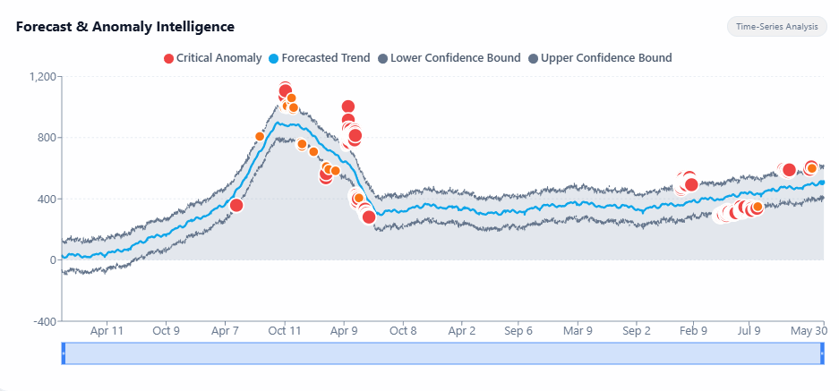
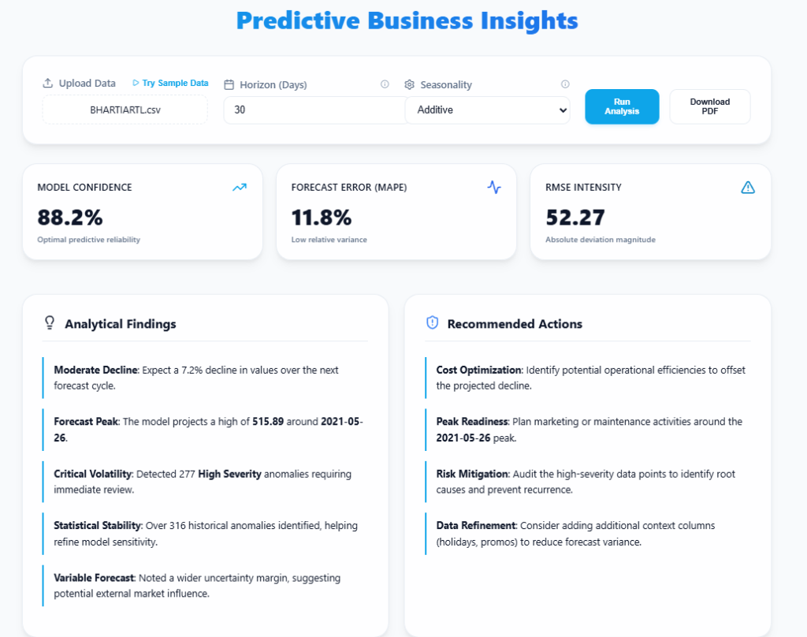
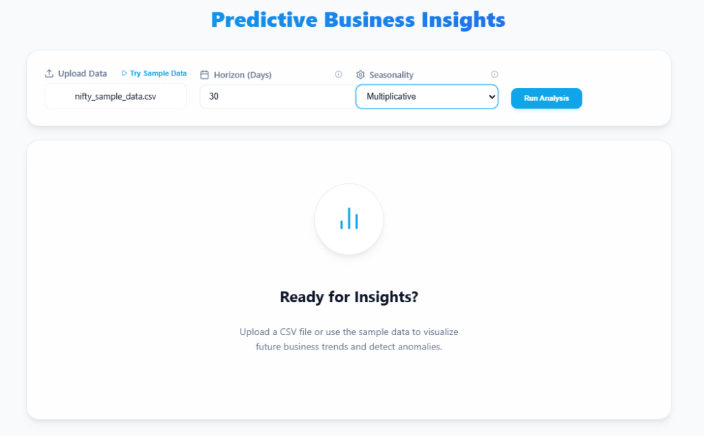

# InsightCast

<p align="center">
  
  
  
  
  
</p>

**InsightCast** is a production-grade analytics platform that transforms raw historical data into actionable future intelligence. It combines advanced time-series forecasting with a modern, reactive dashboard to help businesses anticipate trends and detect anomalies before they impact the bottom line.

---

## 📸 Screenshots

### Interactive Anomaly Detection

*Real-time anomaly detection with severity-based color coding and interactive zoom controls*

### Complete Dashboard View

*Comprehensive analytics with model confidence metrics, insights, and actionable recommendations*

### Clean Empty State

*Intuitive onboarding experience with sample data support*

---

## 🛠️ How It Works

The platform uses a decoupled architecture to separate heavy computational tasks from the user experience:

1.  **Forecasting Engine (Backend):** A FastAPI-driven service that leverages Meta's **Prophet** library for additive and multiplicative time-series modeling. It handles complex seasonalities and provides robust uncertainty intervals.
2.  **Interactive Dashboard (Frontend):** A high-performance React application built with **Vite**, featuring **Recharts** for fluid visualization and **Framer Motion** for a premium, responsive feel.
3.  **Automated Reporting (PDF Engine):** A specialized module using **ReportLab** that compiles data visualizations and natural language insights into professional, shareable PDF reports.

---

## ✨ Features

*   **📈 Advanced Time-Series Forecasting:** High-accuracy predictions using the Prophet algorithm, accounting for holidays, yearly, and weekly seasonality.
*   **⚠️ Intelligent Anomaly Detection:** Automatic identification of data outliers with severity-based color coding (High, Medium, Low) to prioritize critical business events.
*   **🤖 Natural Language Insights:** Heuristic-driven analysis that translates complex statistical metrics (MAE, RMSE, MAPE) into human-readable business summaries.
*   **📄 One-Click PDF Reporting:** Instant generation of comprehensive business reports containing charts, metrics, and forecast summaries.
*   **⚙️ Dynamic Seasonality Tuning:** Ability to switch between Additive and Multiplicative models on the fly to fit different business data types.
*   **🎯 Interactive Chart Controls:** Brush-based zooming with synchronized anomaly rendering for detailed time-range analysis.
*   **🚀 Production-Ready Pipeline:** Optimized CSV processing and clean API architecture for seamless data ingestion.

---

## 🚀 Installation

### 1. Backend (Python/FastAPI)
```bash
# Navigate to backend directory
cd backend

# Create and activate virtual environment
python -m venv venv
source venv/bin/scripts/activate  # On Windows: .\venv\Scripts\activate

# Install dependencies
pip install -r requirements.txt

# Start the server
uvicorn app.main:app --reload
```

### 2. Frontend (React/Vite)
```bash
# Navigate to frontend directory
cd frontend

# Install dependencies
npm install

# Launch development server
npm run dev
```

---

## 💡 Usage

1.  Start both the **Backend** and **Frontend** servers.
2.  Open your browser to `http://localhost:5173`.
3.  Upload a **CSV file** containing at least two columns: `ds` (date) and `y` (value).
4.  Adjust the **Forecast Horizon** (days) and **Seasonality Mode**.
5.  Click **Run Analysis** to visualize trends and download the **PDF Report**.

---

## 🛠️ Troubleshooting

- **CORS Errors:** Ensure the backend is running on port `8000`. The frontend is pre-configured to communicate with `http://127.0.0.1:8000`.
- **CSV Formatting:** Ensure your dates are in a standard ISO format (e.g., `YYYY-MM-DD`) and values are numeric.
- **Missing Forecast:** Check the terminal logs; the Prophet engine requires a minimum number of data points to generate seasonal patterns.

---

## 🗺️ Future Plans

- [ ] Support for multi-variate forecasting (adding external regressors).
- [ ] Direct database integration (PostgreSQL/BigQuery).
- [ ] User authentication and saved forecast history.

---

<p align="center">
  <i>Empowering data-driven decisions with predictive intelligence.</i>
</p>
